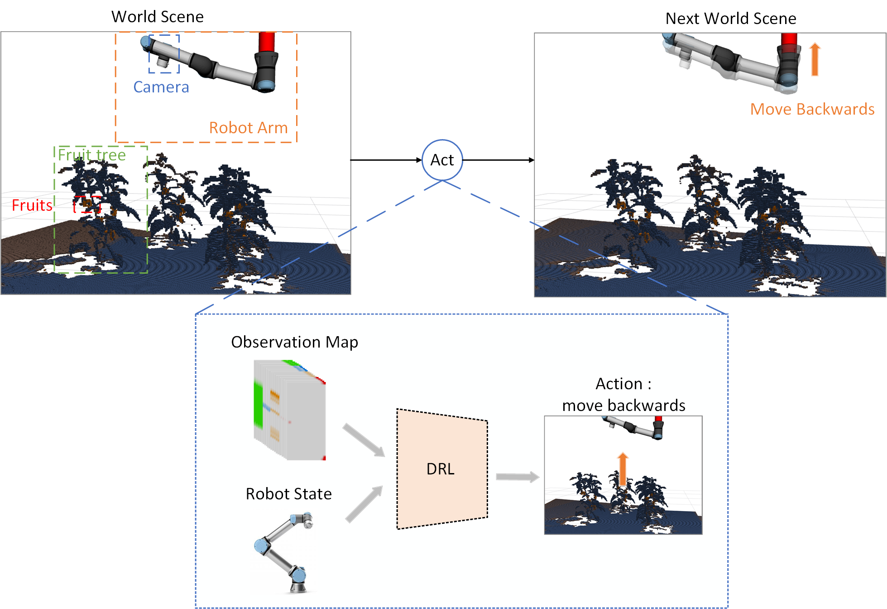

# Deep Reinforcement Learning for Next-Best-View Planning in Agricultural Applications

## Introduction

Automated agricultural applications, i.e., fruit picking require spatial information about crops and, especially, their
fruits. In this paper, we present a novel deep reinforcement learning (DRL) approach to determine the next best view for
automatic exploration of 3D environments with a robotic arm equipped with an RGB-D camera. We process the obtained
images into an octree with labeled regions of interest (ROIs), i.e., fruits. We use this octree to generate 3D
observation maps that serve as encoded input to the DRL network. We hereby do not only rely on known information about
the environment, but explicitly also represent information about the unknown space to force exploration. Our network
takes as input the encoded 3D observation map and the temporal sequence of camera view pose changes, and outputs the
most promising camera movement direction. Our experimental results show an improved ROI targeted exploration performance
resulting from our learned network in comparison to a state-of-the-art method.



## Experiments

### P3D environment

#### Compile p3d environment

```sh compile_pybind11_only.sh```

#### Compile p3d environment with GUI

```sh compile_p3d_modules.sh```

#### Train

``` python3 run_p3d_discrete.py rl_policy --out_folder=test_folder --train```

#### Evaluate, you need to specify your in_folder, out_folder, in_model_index(you can look for the model index in your in_folder/model directory)

```python3 run_p3d_discrete.py  rl_policy --in_folder=in_folder --out_folder=out_folder --in_model_index=2000```

###### Scripts for evaluation experiments in paper
for the environment with different size and number of plants
    evaluate perimeter policy 
```sh evaluate_p3d_circular.sh```
    evaluate rl policy 
```sh evaluate_p3d_rl.sh```
    evaluate random policy
```sh evaluate_p3d_random.sh```

for the environment with fixed size 400x400x150
```sh evaluate_p3d_rl_400x400x150.sh```

##### Plot

...
### ROS environment

Required arguments:

| Parameter     | Default      | Description     |
| ------------- | ------------- | -------- |
| policy        | rl_policy     |  ... |

Optional arguments:

| Parameter     | Default      | Description     |
| ------------- | ------------- | -------- |
| --out_folder        | rl_policy     |  Specify your "out_folder", it will be automatically created in a folder named "output" |

The reinforcement learning lib from https://github.com/pfnet/pfrl.git
